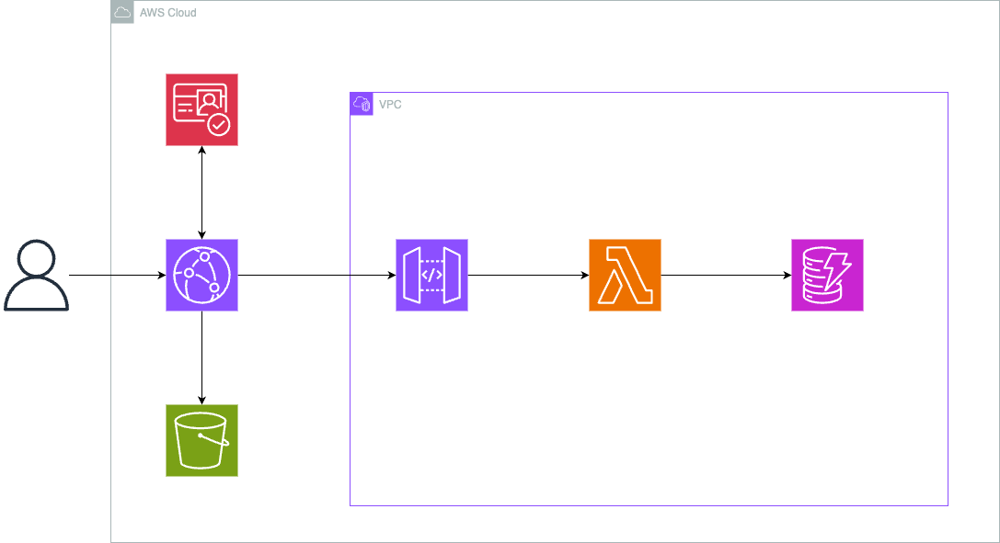

# AxI-budget - 次世代スマート家計簿 PWA

"流れ"を捉える、次世代スマート家計簿アプリケーション

## 🚀 概要

AxI-budgetは、全てのお金の流れを記録しつつ、実際の支出のみを家計管理に反映する革新的なPWA（プログレッシブウェブアプリ）家計簿アプリです。立て替え精算やグループ旅行の割り勘機能も内蔵し、ユーザー登録不要で利用開始できます。

## 🏗️ アーキテクチャ

```
├── frontend/          # React 18 + TypeScript + Vite PWA
├── backend/           # AWS Lambda (Rust)
├── infrastructure/    # Terraform (AWS)
├── api-schema/        # OpenAPI 3.0 スキーマ定義
├── docs/             # 設計書・ドキュメント
└── .github/          # CI/CD (GitHub Actions)
```

## 🎯 開発哲学

- **TDD (Test-Driven Development)**: テスト駆動開発
- **DDD (Domain-Driven Design)**: ドメイン駆動設計
- **Schema-Driven Development**: スキーマ駆動開発

## 🛠️ 技術スタック

### フロントエンド
- React 18 + TypeScript
- Vite (ビルドツール)
- Tailwind CSS (スタイリング)
- Zustand (状態管理)
- Chart.js / Recharts (データ可視化)
- Workbox (PWA/Service Worker)
- Firebase Auth (匿名認証)

### バックエンド
- AWS Lambda (Rust)
- Amazon DynamoDB
- Amazon API Gateway

### インフラ
- Amazon S3 / CloudFront
- Terraform (Infrastructure as Code)
- GitHub Actions (CI/CD)



## 🚀 クイックスタート

### 前提条件
- Node.js 18+
- Rust 1.70+
- AWS CLI
- Terraform

### セットアップ

1. **リポジトリクローン**
```bash
git clone <repository-url>
cd AxI_budget
```

2. **フロントエンド開発環境**
```bash
cd frontend
npm install
npm run dev
```

3. **バックエンド開発環境**
```bash
cd backend
cargo build
cargo test
```

4. **インフラストラクチャ**
```bash
cd infrastructure
terraform init
terraform plan
terraform apply
```

## 📝 開発ワークフロー

1. **スキーマ定義**: `api-schema/` でAPIスキーマを定義
2. **コード生成**: スキーマからフロントエンド・バックエンドの型定義を自動生成
3. **TDD実装**: テストファーストでドメインロジックを実装
4. **統合テスト**: E2Eテストでユーザーストーリーを検証

## 🧪 テスト

```bash
# フロントエンドテスト
cd frontend && npm test

# バックエンドテスト
cd backend && cargo test

# E2Eテスト
cd frontend && npm run test:e2e
```

## 🚀 デプロイ

```bash
# 開発環境
npm run deploy:dev

# 本番環境
npm run deploy:prod
```

## 📄 ライセンス

MIT License
