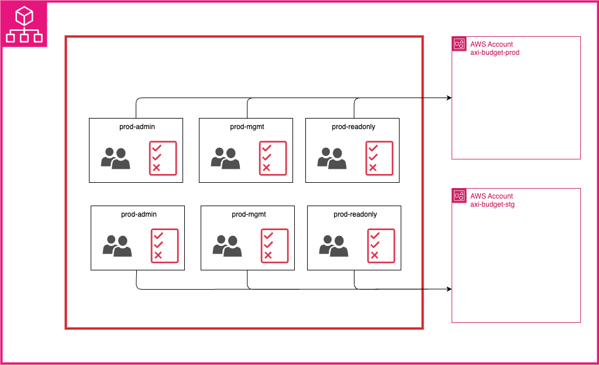

# Terraform Infrastructure

## ディレクトリ構造

```
terraform/
├── env/
│   ├── prod/
│   │   ├── core_system/         # DynamoDB, Lambda, S3, CloudFront, API Gateway, Cognito
│   │   └── monitoring/          # CloudWatch, X-Ray, etc. (将来拡張)
│   └── stg/
│       ├── core_system/         # DynamoDB, Lambda, S3, CloudFront, API Gateway, Cognito
│       └── monitoring/          # CloudWatch, X-Ray, etc. (将来拡張)
├── modules/
│   └── common/
│       ├── core_system/         # コアシステムモジュール
│       ├── cognito/             # 認証モジュール
│       └── monitoring/          # 監視モジュール (将来作成予定)
├── aws-accounts/                # AWS Organizations アカウント管理
├── iic/                         # AWS IAM Identity Center 設定
├── AWS_PROFILE_SETUP.md         # プロファイル設定ガイド
└── .gitignore
```

## AWS プロファイル設定



### 環境別プロファイル
- **本番環境**: `axi-budget-prod`
- **ステージング環境**: `axi-budget-stg`

### 設定方法
1. `AWS_PROFILE_SETUP.md` を参照
2. 各環境で `terraform.tfvars.example` をコピーして `terraform.tfvars` を作成
3. 適切なプロファイル名を設定

## チーム開発での使用方法

### 1. 初回セットアップ
```bash
# リポジトリクローン後
cd terraform/env/stg/core_system
cp terraform.tfvars.example terraform.tfvars
# terraform.tfvars を編集してプロファイルを設定

# AWS CLI プロファイルの設定
aws configure --profile axi-budget-stg
```

### 2. Terraform実行
```bash
# ステージング環境
cd terraform/env/stg/core_system
terraform init
terraform plan
terraform apply

# 本番環境
cd terraform/env/prod/core_system
terraform init
terraform plan
terraform apply
```

### 3. 新機能追加時の構造
```bash
# 例: 新しい機能モジュールの追加
terraform/
├── env/
│   ├── prod/
│   │   ├── core_system/
│   │   ├── monitoring/
│   │   └── new_feature/      # 新機能
│   └── stg/
│       ├── core_system/
│       ├── monitoring/
│       └── new_feature/      # 新機能
└── modules/
    └── common/
        ├── core_system/
        ├── cognito/
        ├── monitoring/
        └── new_feature/      # 新機能のモジュール
```

## セキュリティ

- `terraform.tfvars` はGitに含まれません
- 各開発者が個別のプロファイルを設定
- 環境ごとに異なるAWSアカウントの使用を推奨

## CI/CD対応

各環境でのCI/CD実行時も同様のプロファイル設定を使用：

```yaml
# GitHub Actions例
env:
  AWS_PROFILE: axi-budget-stg
run: |
  cd terraform/env/stg/core_system
  terraform plan
```

## 注意事項

1. **Terraform State Backend**: 各環境で別々のS3バケットを使用
2. **CircularDependency**: Lambda関数とAPI Gatewayの相互参照を避けるため、一時的に空の値を設定
3. **タグ戦略**: すべてのリソースに適切なタグを設定
4. **セキュリティ**: 本番環境では削除保護を有効化

## 今後の改善点

1. **循環依存の解決**: Lambda関数とAPI Gatewayの依存関係を整理
2. **環境固有モジュール**: 環境ごとに特化したモジュールの作成
3. **監視設定**: CloudWatch、X-Rayなどの監視モジュール追加

## AWS Organizations & IAM Identity Center

### 概要

- **aws-accounts/**: AWS Organizationsによるアカウント管理
- **iic/**: AWS IAM Identity Centerによるシングルサインオン設定

### アカウント構成

- **axi-budget-prod**: 本番環境アカウント
- **axi-budget-stg**: ステージング環境アカウント

### IAM Identity Center グループ構成

各環境に対して以下のグループが設定されています：

| 環境 | グループ | 許可セット | 説明 |
|------|----------|------------|------|
| prod/stg | axi-budget-{env}-admin | AdministratorAccess, mgmt, readonlyAccess | 完全な管理者権限 |
| prod/stg | axi-budget-{env}-mgmt | mgmt, readonlyAccess | 管理レベル権限 |
| prod/stg | axi-budget-{env}-readonly | readonlyAccess | 読み取り専用権限 |

### 詳細設定

詳細な設定手順とトラブルシューティングについては、以下を参照してください：
- `aws-accounts/README.md` - AWS Organizations設定
- `iic/README.md` - IAM Identity Center設定
4. **セキュリティ強化**: WAF、SecretsManagerなどの追加
